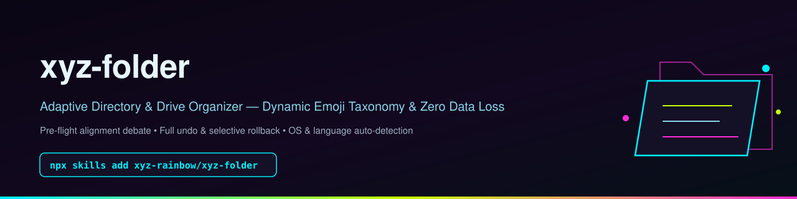
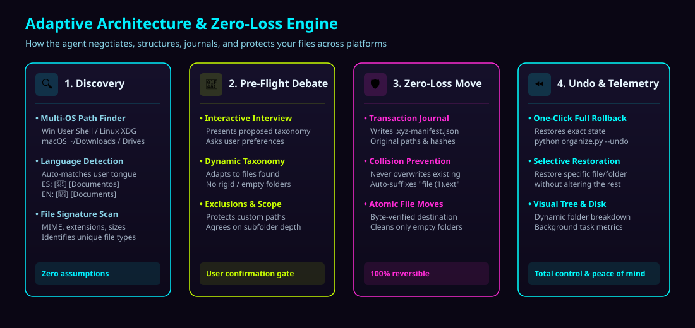
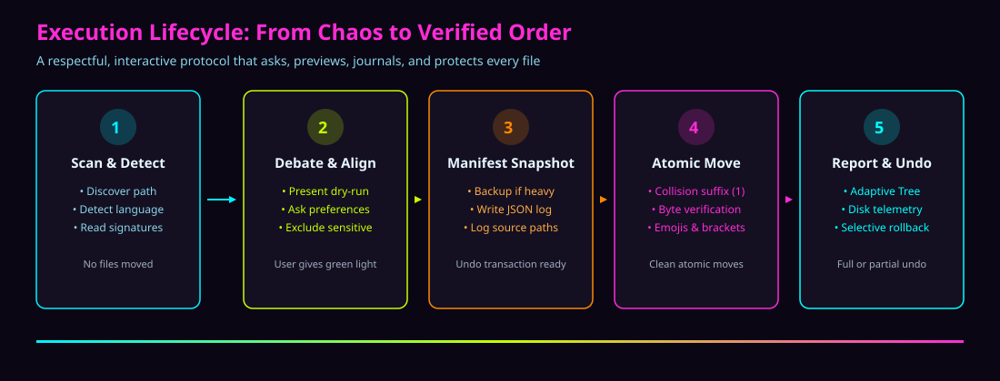

# xyz-folder

**AI agent skill & standalone CLI engine for aesthetic directory and drive organization** — dynamically organizes, categorizes, and normalizes messy folders into an adaptive emoji taxonomy with zero data loss.

Works on **Windows, Linux, and macOS**. Zero external dependencies (Python 3 stdlib only).

<p align="center">
  
  
  
  
  
</p>



---

## One-command installation

Install directly into your agent environment using `skills`:

```bash
npx skills add xyz-rainbow/xyz-folder
```

Or via direct GitHub URL:

```bash
npx skills add https://github.com/xyz-rainbow/xyz-folder
```

Global, non-interactive install:

```bash
npx skills add xyz-rainbow/xyz-folder -g -y
```

---

## Key Capabilities

- **Interactive Alignment First**: The agent will never blindly scramble your files. It scans signatures, asks clarifying questions, debates proposed categories with you, and waits for your confirmation.
- **Full Rollback & Selective Undo**: Every operation writes a `.xyz-folder-manifest.json` transaction log. You can cancel progress, revert everything back to its exact original state (`--undo`), or selectively restore individual files/folders.
- **Safety Checkpoints & Backup Verification**: Automatically checks disk health and available capacity. For large operations or cross-disk migrations (robocopy/rsync), ensures safety checkpoints exist before moving bytes.
- **Aesthetic Double-Bracket Layout**: Categorizes loose files into clean `[emoji] [Category]/[emoji] [Subcategory]/` directories.
- **Zero Data Loss Guarantee**: Atomic moves with programmatic byte-verification. Destination collisions automatically append safe version counters (`file (1).ext`) — never overwriting.
- **Dynamic Localization**: Automatically detects and speaks your language (Spanish, English, etc.), creating localized folder names (e.g. `[🎨] [Multimedia]/[🖼️] [Imágenes]` or `[🎨] [Media]/[🖼️] [Images]`).





---

## Adaptive Taxonomy Showcase

> [!NOTE]
> The taxonomy below is an **illustrative reference example**. Categories and emojis dynamically adapt to whatever files are discovered in the target directory.

```text
Directory/
├── [📦] [Installers]/
│   ├── [💻] [Desktop Apps]/
│   └── [📱] [Mobile & Packages]/
├── [📄] [Documents]/
│   ├── [📑] [PDFs & Books]/
│   ├── [📊] [Office & Sheets]/
│   └── [📝] [Notes & Text]/
├── [🎨] [Media]/
│   ├── [🖼️] [Images]/
│   ├── [🎬] [Videos]/
│   └── [🎵] [Audio]/
├── [🗜️] [Archives]/
│   ├── [📦] [ZIP & RAR]/
│   └── [💿] [Disk Images & ISOs]/
└── [💻] [Development & AI]/
    ├── [🤖] [Models & Weights]/
    ├── [🐙] [Repos & Code]/
    └── [🛠️] [Scripts & Config]/
```

---

## Standalone CLI Engine

The bundled `scripts/organize.py` serves as a reference engine and can be executed standalone:

### 1. Preview changes (Dry-Run):
```bash
python3 scripts/organize.py --dry-run
```

### 2. Organize custom folder with language selection:
```bash
# Spanish categories:
python3 scripts/organize.py --target "/path/to/folder" --lang es

# English categories:
python3 scripts/organize.py --target "/path/to/folder" --lang en
```

### 3. Full Rollback (Undo entire operation):
```bash
python3 scripts/organize.py --target "/path/to/folder" --undo
```

### 4. Selective Restoration (Restore specific files or patterns):
```bash
python3 scripts/organize.py --target "/path/to/folder" --restore-filter ".pdf"
```

> **Note for AI Agents**: `scripts/organize.py` is a baseline reference. Agents are instructed to tailor, extend, or generate custom migration and organization scripts dynamically to best fit the user's specific files, operating system, and storage topology.

---

## GitHub topics

`ai-agent-skill` `skills-sh` `npx-skills-add` `agent-skills` `folder-organizer` `directory-organizer` `file-organizer` `zero-data-loss` `windows` `linux` `macos` `python`

---

## Sponsor this project

If this skill helps keep your workspace, downloads, and storage clean:

- [Buy Me a Coffee](https://buymeacoffee.com/xyzclouds)
- [Ko-fi](https://ko-fi.com/xyzclouds)
- [Patreon](https://patreon.com/xyzclouds)
- [PayPal](https://paypal.me/rainbowkolors)

---

## License

MIT © [xyz-rainbow](https://github.com/xyz-rainbow). See [LICENSE](LICENSE).
